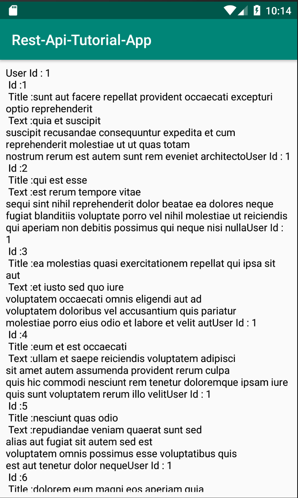

# This is android tutorial for using retrofit2 library to communicate with API SERVER


## What I Add in Gradle 

```groovy
implementation group: 'com.squareup.retrofit2', name: 'retrofit', version: '2.3.0'
implementation group: 'com.squareup.retrofit2', name: 'converter-gson', version: '2.3.0'
```


## Demo

